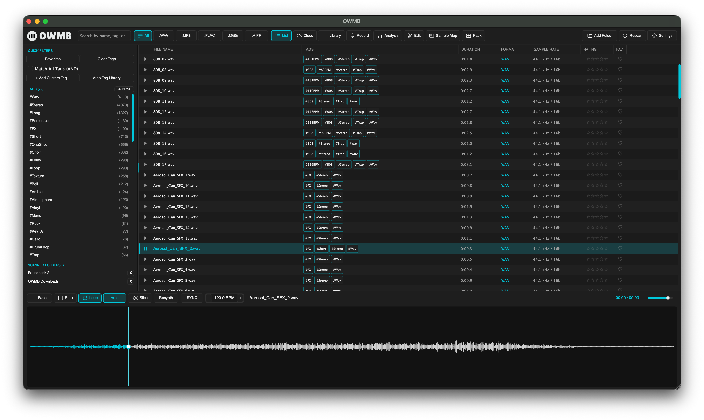
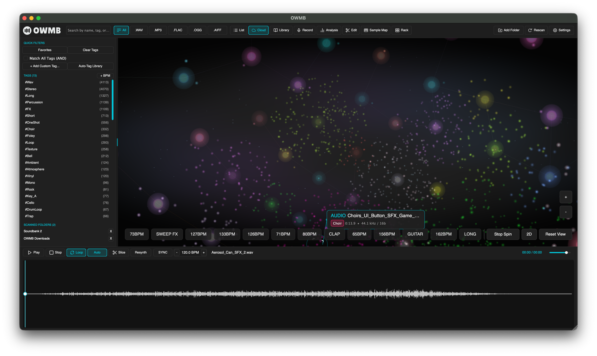
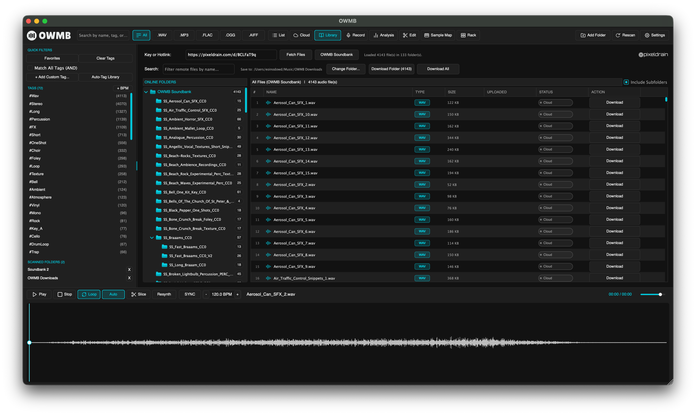
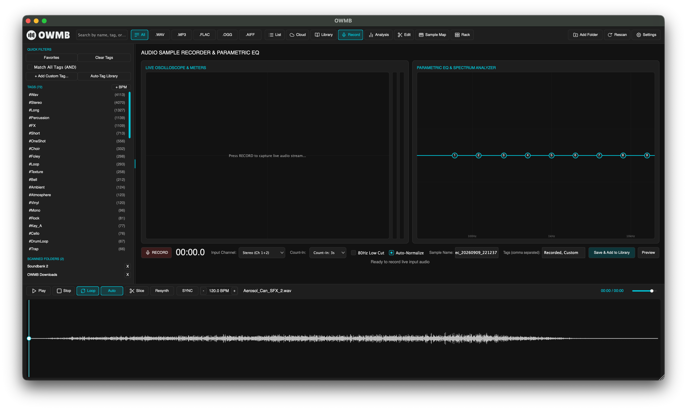
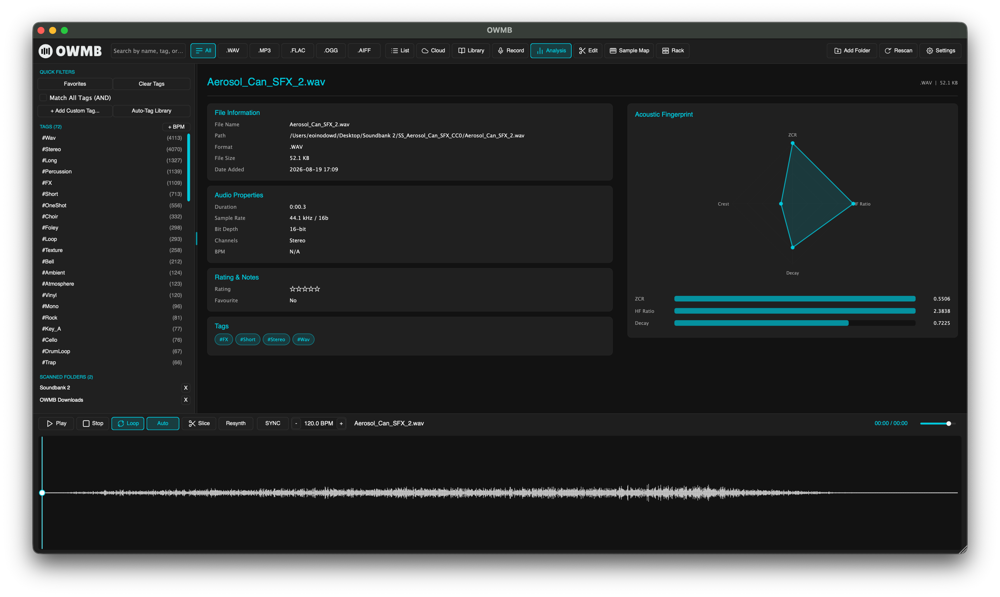
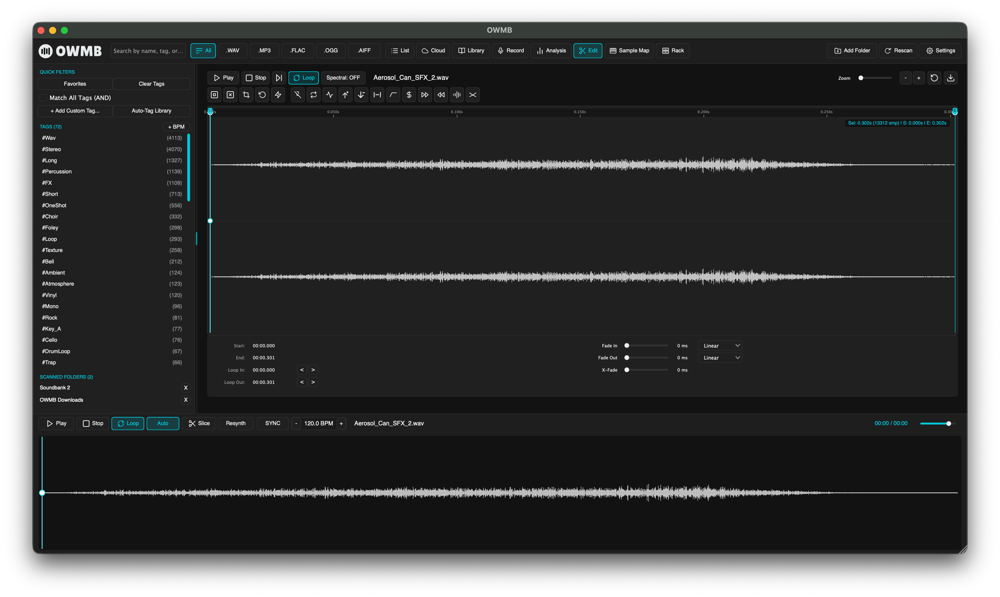
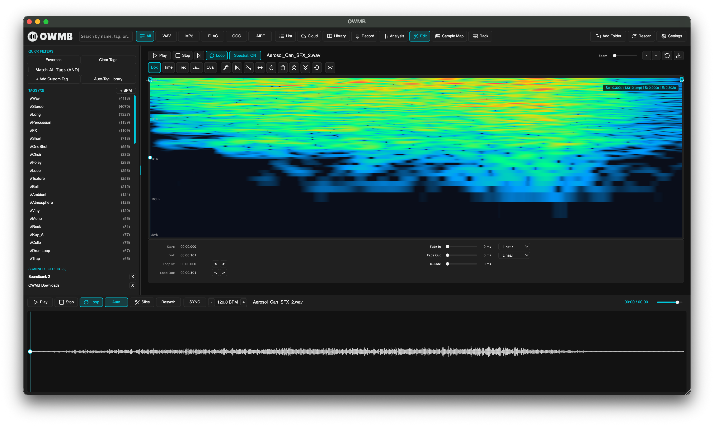
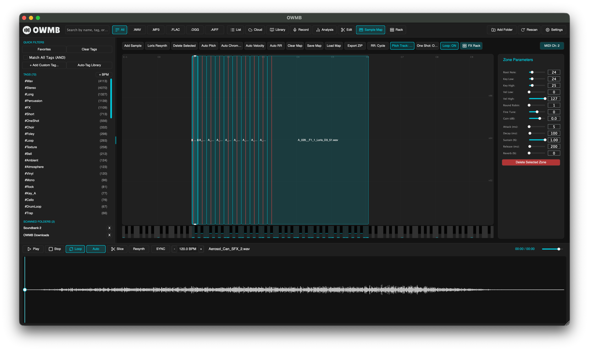
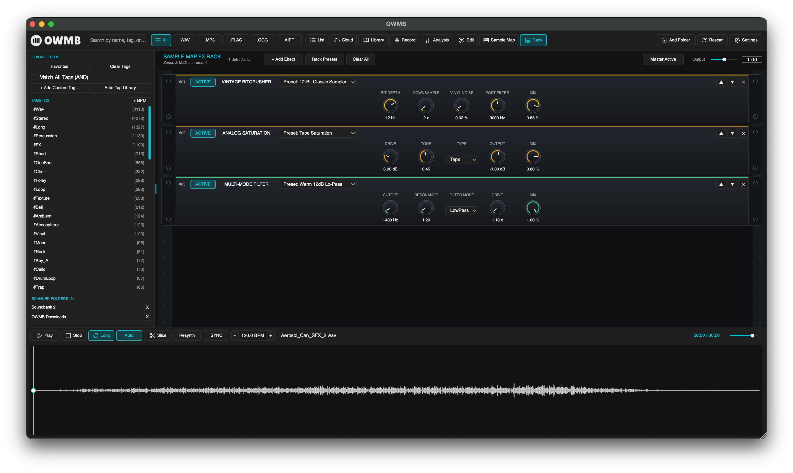

# OWMB - OpenWav Media Browser (Audio Plugin & Standalone App)

**OWMB** (OpenWav Media Browser) is an open-source, high-performance audio plugin (VST3, Standalone) and sample library management system built with JUCE 8 and C++17. Designed for music producers, sound designers, and sample collectors, **OWMB** features an interactive **3D and 2D Sample Cloud Constellation Visualizer**, multi-tag filtering, ultra-fast asynchronous WAV scanning, and direct DAW drag-and-drop integration.

## Visual Tour & Workspaces

Explore the core workspaces and specialized sound design views within OWMB:

### 1. List Browser & Waveform Transport
Multi-column sample browser with instant multi-tag Boolean filtering (AND/OR logic), format filters (`.WAV`, `.MP3`, `.FLAC`, `.OGG`, `.AIFF`), scanned folder manager, and waveform playback transport with transient auto-slicing and Loris resynthesis.



### 2. 3D Cloud Constellation Visualizer
Interactive 3D spatial constellation clustering thousands of samples organically by acoustic timbre and spectral similarity. Features hardware-accelerated orbital camera navigation, tag pills, instant node auditioning, and real-time additive resynthesis.



### 3. Online Cloud Soundbank Library
Direct integration with cloud storage (Pixeldrain) for discovering, previewing, and downloading curated soundbanks, royalty-free sample collections, and instrument bundles straight into your local workspace.



### 4. Audio Sample Recorder & Parametric EQ
Full-featured stereo audio recording suite with live input level meters, count-in metronome, low-cut filter, live oscilloscope, and an interactive parametric equalizer.



### 5. Acoustic Fingerprint & Timbral Analysis
Comprehensive real-time acoustic analysis and timbral radar chart displaying Zero Crossing Rate (ZCR), Crest Factor, High-Frequency (HF) Energy Ratio, and Envelope Decay metrics.



### 6. Waveform Editor & Transient Slicer
Precision sample editing suite featuring automatic beat and transient slicing, zoomable waveform navigation, attack/decay crossfades, sample reverse, and loop point configurations.



### 7. Spectral Audio Editor
High-resolution STFT spectrogram visualization for inspecting harmonic structures, spectral distribution, and frequency-domain audio editing with interactive selection brushes.



### 8. Multi-Velocity Keyzone Sample Mapper
Comprehensive chromatic sample mapping instrument on **MIDI Channel 2** with interactive on-screen keybed (velocity-sensitive Y-axis positioning: bottom of key = 127, top = lowest velocity), zone ADSR shaping, auto-pitch detection, chromatic distribution, auto-velocity spreading, and round-robin cycle modes.



### 9. 16-DSP Effects Rack
Modular 19" rack-mount hardware-style effects rack exclusively dedicated to sample mapped zones and MIDI instruments. Includes 16 studio-grade DSP units (Vintage Bitcrusher, Analog Saturation, Multi-Mode Filter, Stereo Delay, Algorithmic Reverb, Chorus, Flanger, Phaser, Pitch Shifter, Wavefolder, Auto-Pan, Graphic EQ, Master Limiter, Stereo Widener, Ring Modulator, Noise Gate) with draggable re-ordering, active bypass toggles, and factory presets.



---

## Key Features

- **3D Cloud Instant Preview & Resynthesis**: Seamlessly explore your sample library in a 3D constellation with real-time additive resynthesis powered by Loris.
- **Interactive 2D/3D Zoom & Pan**: Fluid navigation through thousands of samples with high-performance hardware-accelerated rendering and orbital camera rotation.
- **Multi-Velocity Keyzone Sample Mapper**: Chromatic zone mapping on MIDI Channel 2 with velocity-sensitive on-screen keybed, auto-pitch, auto-chromatic mapping, auto-velocity spreading, and round-robin triggering.
- **16-DSP Modular Effects Rack**: Dedicated 19" rack effects processor for mapped instruments featuring 16 studio-grade DSP algorithms (Bitcrusher, Tape Saturation, Multi-Mode Filter, Chorus, Reverb, Delay, and more) with custom presets.
- **Waveform Slicer & Spectral Editor**: Precision transient slicing, loop points, fades, and high-resolution STFT spectrogram visualization.
- **Audio Recorder & Parametric EQ**: Direct stereo audio sample recorder with live monitoring and parametric equalization.
- **Acoustic Fingerprint Radar**: Timbral analysis profiling Crest factor, Zero Crossing Rate, HF content, and envelope decay.
- **Online Cloud Soundbanks**: Browse and download soundbank packs directly from Pixeldrain into local storage.
- **Advanced Tag-Based Searching**: Powerful filtering with automated inference and multi-tag Boolean (AND/OR) queries to find sounds faster than ever.
- **Ultra-Fast Asynchronous Library Scanner**: Rapidly index massive sample libraries without impacting audio playback or UI performance.
- **Sample Map Management**: Full support for exporting and importing sample map bundles (.zip) with automated sample reloading and mapping state synchronization.
- **DAW Drag-and-Drop**: Effortless integration with all major DAWs (Ableton Live, FL Studio, Logic Pro, Reaper, Cubase, Bitwig). (Note: On macOS, hold `Control` while dragging to ensure proper OS-level drag-and-drop behavior).
- **Platform Agnostic**: Stable performance across Windows 11, macOS (Apple Silicon & Intel), and Linux.

## Application Keyboard Shortcuts

| Key | Action |
| :--- | :--- |
| `Space` | Play/Pause / Transport Control |
| `Enter` | Trigger Convert / Confirm Action |
| `Escape` | Cancel / Close Dialogs |
| `Delete` / `Backspace` | Delete Selection |
| `Up` | Previous Item / Increase Value |
| `Down` | Next Item / Decrease Value |
| `Left` | Previous Item / Decrease Note |
| `Right` | Next Item / Increase Note |
| `Numpad +` | Increment Selection/Value |
| `Numpad -` | Decrement Selection/Value |
| `Numpad 0` | Reset Selection/Value |

---

## Download & Releases

Pre-built binaries and installers for **Windows 11**, **macOS** (Universal for Apple Silicon & Intel), and **Linux Distros** are available under [GitHub Releases](https://github.com/samplaman/owmb/releases).

- **Microsoft Store / Standalone (.exe)**: `OWMB-MicrosoftStore-Standalone.exe` (Unzipped Direct Executable)
- **Windows Installer (.exe)**: `OWMB-MicrosoftStore-Installer.exe` / `OWMB-Installer.exe` (Unzipped Setup Installer)
- **Windows 11 Bundle (.zip)**: `OWMB-Windows-11-x64.zip` (VST3 Plugin & Standalone `.exe`)
- **macOS Universal Installer (.pkg / .dmg)**: `OWMB-macOS-Universal-Installer.pkg` / `OWMB-macOS-Universal-Installer.dmg` / `OWMB-macOS-Universal.dmg` (VST3, AU & App for Apple Silicon & Intel)
- **Linux Distros (.tar.gz)**: `OWMB-Linux-Distros-x64.tar.gz` (VST3 Plugin & Standalone Executable)

> [!TIP]
> **macOS Installation & Gatekeeper**:
> - **Native Package Installer (`.pkg`)**: Run `OWMB-macOS-Universal-Installer.pkg` to install the standalone application (`/Applications`), VST3 (`/Library/Audio/Plug-Ins/VST3`), and AU Component (`/Library/Audio/Plug-Ins/Components`).
> - **Disk Image Installer (`.dmg`)**: You can also open `OWMB-macOS-Universal-Installer.dmg` and drag the app and plugins into the folder shortcuts.
> - If macOS Gatekeeper displays an "unidentified developer" prompt, Control-click (or right-click) the `.pkg` and select **Open**, or navigate to **System Settings > Privacy & Security** and click **Open Anyway**.

---

## Building OWMB Locally

### Requirements
- **CMake** 3.22 or higher
- C++17 compatible compiler (Visual Studio 2022 / MSVC, Clang, or GCC)
- **Git** (for automatically fetching JUCE 8 via CMake `FetchContent`)

### Build Steps

#### macOS (Universal: Apple Silicon & Intel)
```bash
# Clone the repository
git clone https://github.com/samplaman/owmb.git
cd owmb

# Option A: Use the macOS build helper script
./build-macos.sh

# Option B: Manual CMake configuration
cmake -B build -DCMAKE_BUILD_TYPE=Release \
  -DCMAKE_OSX_ARCHITECTURES="arm64;x86_64" \
  -DCMAKE_OSX_DEPLOYMENT_TARGET="10.15"
cmake --build build --config Release -j 4
```

#### Windows & Linux
```bash
# Configure build directory with CMake
cmake -B build -DCMAKE_BUILD_TYPE=Release

# Compile VST3 & Standalone targets
cmake --build build --config Release -j 4
```

The compiled binaries will be output in:
- **VST3 Plugin**: `build/OpenWav_artefacts/Release/VST3/OWMB.vst3`
- **AU Plugin (macOS)**: `build/OpenWav_artefacts/Release/AU/OWMB.component`
- **Standalone App**: `build/OpenWav_artefacts/Release/Standalone/OWMB.app` (macOS) or `OWMB.exe` (Windows)

### macOS Code Signing & Notarization
See [docs/MACOS_CODESIGNING_GUIDE.md](docs/MACOS_CODESIGNING_GUIDE.md) for full instructions on signing and notarizing with your Apple Developer Account (Developer ID Application).

---

## Architecture & Project Structure

```
owmb/
├── CMakeLists.txt              # CMake build configuration (JUCE 8 FetchContent)
├── .github/workflows/          # Automated GitHub Actions CI/CD release workflow
│   └── release.yml             # Windows 11 & Linux matrix release builder
├── docs/                       # Project documentation & preview screenshots
│   ├── MACOS_CODESIGNING_GUIDE.md
│   └── screenshots/            # High-resolution screenshots of all 9 workspaces
│       ├── 01-list-browser.png
│       ├── 02-3d-cloud.png
│       ├── 03-online-library.png
│       ├── 04-recorder-eq.png
│       ├── 05-acoustic-analysis.png
│       ├── 06-waveform-editor.png
│       ├── 07-spectral-editor.png
│       ├── 08-sample-map.png
│       └── 09-effects-rack.png
└── Source/
    ├── Audio/                  # Asynchronous disk read-ahead sample transport engine
    │   ├── AudioEngine.h / .cpp
    │   └── EffectsRackEngine.h / .cpp        # 16-DSP studio rack effects processor
    ├── Database/               # Persistent JSON metadata library index & tag manager
    │   ├── TagDatabaseManager.h / .cpp
    │   └── PixeldrainClient.h / .cpp
    ├── Models/                 # MediaItem & SampleMap data structures & serialization
    │   ├── MediaItem.h
    │   └── SampleMap.h
    ├── Scanner/                # Multi-threaded fast RIFF/WAVE header reader scanner
    │   ├── LibraryScanner.h / .cpp
    │   └── AcousticAnalyzer.h / .cpp
    └── UI/                     # JUCE LookAndFeel & GUI components
        ├── HeaderBarComponent.h / .cpp       # Top control bar, search, & view switcher
        ├── TagPanelComponent.h / .cpp        # Sidebar tag cloud & scanned folders manager
        ├── SampleTableComponent.h / .cpp     # Multi-column sample list table view
        ├── SampleCloudComponent.h / .cpp     # 3D interactive sample constellation visualizer
        ├── WaveformTransportComponent.h / .cpp # Audio waveform player & playhead transport
        ├── AudioRecorderComponent.h / .cpp   # Audio recorder with parametric EQ
        ├── AcousticAnalysisComponent.h / .cpp # Timbral radar chart & spectral analysis
        ├── WaveformEditorComponent.h / .cpp  # Waveform editor, transient slicer & fades
        ├── SpectralEditorComponent.h / .cpp  # High-resolution spectrogram spectral editor
        ├── SampleMapComponent.h / .cpp       # Multi-velocity sample mapper with keybed
        ├── EffectsRackComponent.h / .cpp     # 16-DSP modular effects rack
        └── OpenWavLookAndFeel.h / .cpp       # Pro-audio dark LookAndFeel design system
```

---

## License

Copyright (c) 2026 OWMB Developer. Open-source under MIT / JUCE 8 License terms.
