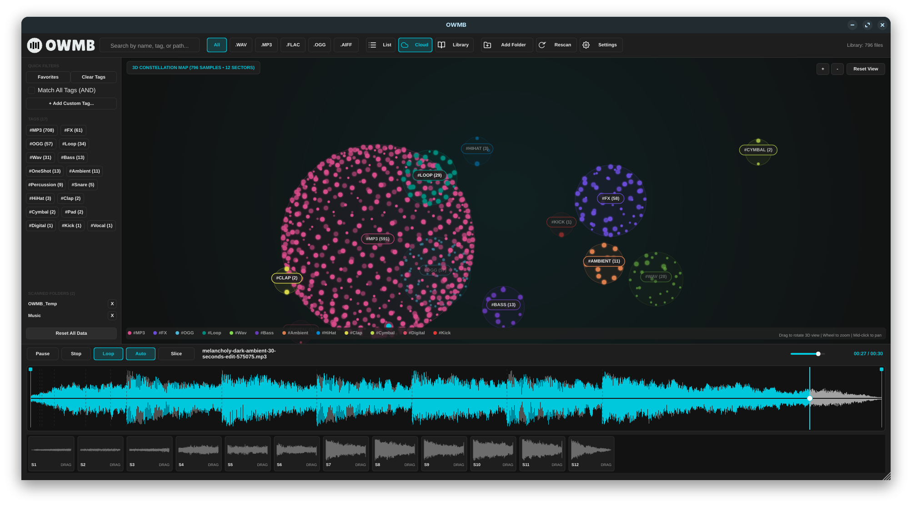

# OWMB - OpenWav Media Browser (Audio Plugin & Standalone App)

**OWMB** (OpenWav Media Browser) is an open-source, high-performance audio plugin (VST3, Standalone) and sample library management system built with JUCE 8 and C++17. Designed for music producers, sound designers, and sample collectors, **OWMB** features an interactive **2D Sample Cloud Constellation Visualizer**, multi-tag filtering, ultra-fast asynchronous WAV scanning, and direct DAW drag-and-drop integration.



---

## Key Features

- **3D Cloud Instant Preview & Resynthesis**: Seamlessly explore your sample library in a 3D constellation with real-time additive resynthesis powered by Loris.
- **Interactive 2D/3D Zoom & Pan**: Fluid navigation through thousands of samples with high-performance hardware-accelerated rendering.
- **Advanced Tag-Based Searching**: Powerful filtering with automated inference to find your sounds faster than ever.
- **Ultra-Fast Asynchronous Library Scanner**: Rapidly index massive sample libraries without impacting performance.
- **Loris Additive Resynthesis**: High-quality spectral re-synthesis tools integrated directly into the workflow.
- **Modern Typography & UI Styling**: Clean, production-ready interface with refined light and dark modes, plus enhanced settings menus.
- **Sample Map Management**: Full support for exporting and importing sample map bundles (.zip) with automated sample reloading and mapping state synchronization.
- **DAW Drag-and-Drop**: Effortless integration with all major DAWs. (Note: On macOS, please hold `Control` while dragging to ensure proper OS-level drag-and-drop behavior).
- **Platform Agnostic**: Stable performance across Windows 11, macOS (Apple Silicon & Intel), and Linux.

## Application Keyboard Shortcuts

| Key | Action |
| :--- | :--- |
| `Space` | Play/Pause / Transport Control |
| `Enter` | Trigger Convert / Confirm Action |
| `Escape` | Cancel / Close Dialogs |
| `Delete` / `Backspace` | Delete Selection |
| `Up` | Previous Item / Increase Value |
| `Down` | Next Item / Decrease Value |
| `Left` | Previous Item / Decrease Note |
| `Right` | Next Item / Increase Note |
| `Numpad +` | Increment Selection/Value |
| `Numpad -` | Decrement Selection/Value |
| `Numpad 0` | Reset Selection/Value |

---

## Download & Releases

Pre-built binaries and installers for **Windows 11**, **macOS** (Universal for Apple Silicon & Intel), and **Linux Distros** are available under [GitHub Releases](https://github.com/samplaman/owmb/releases).

- **Microsoft Store / Standalone (.exe)**: `OWMB-MicrosoftStore-Standalone.exe` (Unzipped Direct Executable)
- **Windows Installer (.exe)**: `OWMB-MicrosoftStore-Installer.exe` / `OWMB-Installer.exe` (Unzipped Setup Installer)
- **Windows 11 Bundle (.zip)**: `OWMB-Windows-11-x64.zip` (VST3 Plugin & Standalone `.exe`)
- **macOS Universal Installer (.pkg / .dmg)**: `OWMB-macOS-Universal-Installer.pkg` / `OWMB-macOS-Universal-Installer.dmg` / `OWMB-macOS-Universal.dmg` (VST3, AU & App for Apple Silicon & Intel)
- **Linux Distros (.tar.gz)**: `OWMB-Linux-Distros-x64.tar.gz` (VST3 Plugin & Standalone Executable)

---

## Building OWMB Locally

### Requirements
- **CMake** 3.22 or higher
- C++17 compatible compiler (Visual Studio 2022 / MSVC, Clang, or GCC)
- **Git** (for automatically fetching JUCE 8 via CMake `FetchContent`)

### Build Steps

#### macOS (Universal: Apple Silicon & Intel)
```bash
# Clone the repository
git clone https://github.com/samplaman/owmb.git
cd owmb

# Option A: Use the macOS build helper script
./build-macos.sh

# Option B: Manual CMake configuration
cmake -B build -DCMAKE_BUILD_TYPE=Release \
  -DCMAKE_OSX_ARCHITECTURES="arm64;x86_64" \
  -DCMAKE_OSX_DEPLOYMENT_TARGET="10.15"
cmake --build build --config Release -j 4
```

#### Windows & Linux
```bash
# Configure build directory with CMake
cmake -B build -DCMAKE_BUILD_TYPE=Release

# Compile VST3 & Standalone targets
cmake --build build --config Release -j 4
```

The compiled binaries will be output in:
- **VST3 Plugin**: `build/OpenWav_artefacts/Release/VST3/OWMB.vst3`
- **AU Plugin (macOS)**: `build/OpenWav_artefacts/Release/AU/OWMB.component`
- **Standalone App**: `build/OpenWav_artefacts/Release/Standalone/OWMB.app` (macOS) or `OWMB.exe` (Windows)

### macOS Code Signing & Notarization
See [docs/MACOS_CODESIGNING_GUIDE.md](docs/MACOS_CODESIGNING_GUIDE.md) for full instructions on signing and notarizing with your Apple Developer Account (Developer ID Application).

---

## Architecture & Project Structure

```
owmb/
├── CMakeLists.txt              # CMake build configuration (JUCE 8 FetchContent)
├── .github/workflows/          # Automated GitHub Actions CI/CD release workflow
│   └── release.yml             # Windows 11 & Linux matrix release builder
├── docs/                       # Project documentation & preview screenshots
│   └── owmb_cloud_preview.png
└── Source/
    ├── Audio/                  # Asynchronous disk read-ahead sample transport engine
    │   ├── AudioEngine.h
    │   └── AudioEngine.cpp
    ├── Database/               # Persistent JSON metadata library index & tag manager
    │   ├── TagDatabaseManager.h
    │   └── TagDatabaseManager.cpp
    ├── Models/                 # MediaItem data structure & serialization
    │   └── MediaItem.h
    ├── Scanner/                # Multi-threaded fast RIFF/WAVE header reader scanner
    │   ├── LibraryScanner.h
    │   └── LibraryScanner.cpp
    └── UI/                     # JUCE LookAndFeel & GUI components
        ├── HeaderBarComponent.h / .cpp       # Top control bar, search, & view switcher
        ├── TagPanelComponent.h / .cpp       # Sidebar tag cloud & scanned folders manager
        ├── SampleTableComponent.h / .cpp     # Multi-column sample list table view
        ├── SampleCloudComponent.h / .cpp     # 2D interactive sample constellation visualizer
        ├── WaveformTransportComponent.h / .cpp # Audio waveform player & playhead transport
        └── OpenWavLookAndFeel.h / .cpp       # Pro-audio Light/Dark LookAndFeel design system
```

---

## License

Copyright (c) 2026 OWMB Developer. Open-source under MIT / JUCE 8 License terms.
