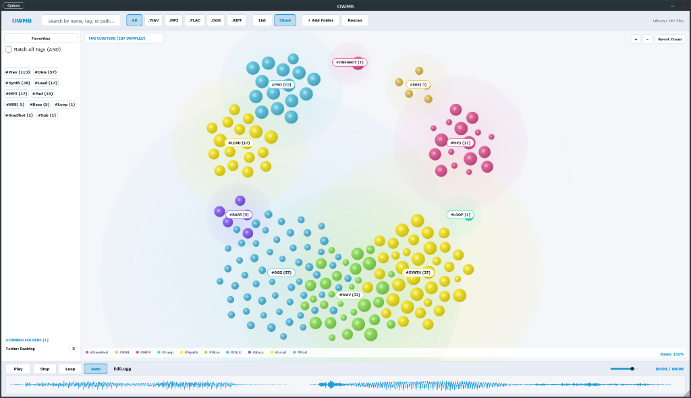

# OWMB - OpenWav Media Browser (Audio Plugin & Standalone App)

**OWMB** (OpenWav Media Browser) is an open-source, high-performance audio plugin (VST3, Standalone) and sample library management system built with JUCE 8 and C++17. Designed for music producers, sound designers, and sample collectors, **OWMB** features an interactive **2D Sample Cloud Constellation Visualizer**, multi-tag filtering, ultra-fast asynchronous WAV scanning, and direct DAW drag-and-drop integration.



---

## Key Features

- 🌌 **2D Interactive Sample Cloud Visualizer**: Explore audio samples visually mapped into color-coded category clusters (`Kicks`, `Snares`, `HiHats`, `Bass`, `Synth`, `Loops`, etc.) with 3D radial gradients, force-directed anti-collision layout, dynamic sound pulse rings, and mini-waveform hover tooltips.
- 🔍 **Interactive Zoom & Pan**: Scroll mouse wheel to zoom (`30%` to `400%`) into any node cluster, click and drag empty space to pan canvas, and use top-right HUD zoom controls.
- 🏷️ **Tag-Based Searching & Auto-Inference**: Automatically infers tags from folder structures and filenames (`#Kick`, `#Snare`, `#HiHat`, `#Loop`, `#OneShot`, `#Bass`, `#Synth`, `#808`, `#Vocal`, `#FX`, etc.).
- ⚡ **Ultra-Fast Asynchronous Library Scanner**: Binary RIFF/WAVE header parser indexes thousands of audio files per second without freezing the DAW UI or audio thread.
- 📁 **Scanned Folders Management**: View and remove scanned folder directories with instant database index purging.
- 🙈 **Hidden File Filtering**: Automatically ignores hidden files (`.DS_Store`, `.git`, `._kick.wav`, hidden OS temp files starting with `.`).
- 🎨 **Sleek Pro Light & Dark UI**: Crisp high-contrast pro audio interface with responsive button padding and centered typography.
- 🎛️ **DAW Drag-and-Drop**: Drag audio samples directly from the sample table or 2D cloud nodes into any DAW (Ableton Live, FL Studio, Logic Pro, Reaper, Cubase, Bitwig).
- 🚀 **GitHub Actions Auto-Releases**: Multi-platform automated CI/CD builds for **Windows 11 (x64)** and **Linux Distros (x64)**.

---

## Download & Releases

Pre-built binaries for **Windows 11** and **Linux Distros** are available under [GitHub Releases](https://github.com/samplaman/owmb/releases).

- **Windows 11**: `OWMB-Windows-11-x64.zip` (VST3 Plugin & Standalone `.exe`)
- **Linux Distros**: `OWMB-Linux-Distros-x64.tar.gz` (VST3 Plugin & Standalone Executable)

---

## Building OWMB Locally

### Requirements
- **CMake** 3.22 or higher
- C++17 compatible compiler (Visual Studio 2022 / MSVC, Clang, or GCC)
- **Git** (for automatically fetching JUCE 8 via CMake `FetchContent`)

### Build Steps

```bash
# 1. Clone the repository
git clone https://github.com/samplaman/owmb.git
cd owmb

# 2. Configure build directory with CMake
cmake -B build -DCMAKE_BUILD_TYPE=Release

# 3. Compile VST3 & Standalone targets
cmake --build build --config Release -j 4
```

The compiled binaries will be output in:
- **VST3 Plugin**: `build/OpenWav_artefacts/Release/VST3/OWMB.vst3`
- **Standalone App**: `build/OpenWav_artefacts/Release/Standalone/OWMB.exe`

---

## Architecture & Project Structure

```
owmb/
├── CMakeLists.txt              # CMake build configuration (JUCE 8 FetchContent)
├── .github/workflows/          # Automated GitHub Actions CI/CD release workflow
│   └── release.yml             # Windows 11 & Linux matrix release builder
├── docs/                       # Project documentation & preview screenshots
│   └── owmb_cloud_preview.png
└── Source/
    ├── Audio/                  # Asynchronous disk read-ahead sample transport engine
    │   ├── AudioEngine.h
    │   └── AudioEngine.cpp
    ├── Database/               # Persistent JSON metadata library index & tag manager
    │   ├── TagDatabaseManager.h
    │   └── TagDatabaseManager.cpp
    ├── Models/                 # MediaItem data structure & serialization
    │   └── MediaItem.h
    ├── Scanner/                # Multi-threaded fast RIFF/WAVE header reader scanner
    │   ├── LibraryScanner.h
    │   └── LibraryScanner.cpp
    └── UI/                     # JUCE LookAndFeel & GUI components
        ├── HeaderBarComponent.h / .cpp       # Top control bar, search, & view switcher
        ├── TagPanelComponent.h / .cpp       # Sidebar tag cloud & scanned folders manager
        ├── SampleTableComponent.h / .cpp     # Multi-column sample list table view
        ├── SampleCloudComponent.h / .cpp     # 2D interactive sample constellation visualizer
        ├── WaveformTransportComponent.h / .cpp # Audio waveform player & playhead transport
        └── OpenWavLookAndFeel.h / .cpp       # Pro-audio Light/Dark LookAndFeel design system
```

---

## License

Copyright (c) 2026 OWMB Developer. Open-source under MIT / JUCE 8 License terms.
